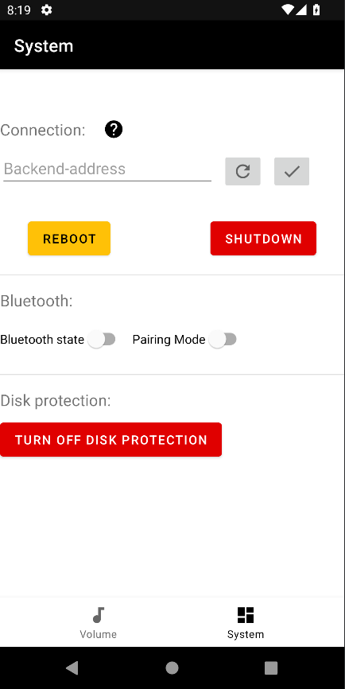

# Projekt-Umsetzung

## Betriebssysteminstallation

Zu Beginn des Projekts wird die neueste Version des Raspberry Pi OS Lite in der 64-Bit-Version (Version 11 vom 28.01.2022) von [Raspberry Pi](https://www.raspberrypi.com/software/operating-systems/) heruntergeladen.
Das heruntergeladene Image wird mit Hilfe von Balena Etcher auf die SD-Karte geflasht. Die Software kann unter [Balena Etcher](https://www.balena.io/etcher/) heruntergeladen werden.

Anschließend sind weitere Schritte erforderlich, um den Raspberry Pi automatisch einem WLAN-Netzwerk hinzuzufügen und den SSH-Server zu aktivieren.
Dazu wird mit einer beliebigen Dateiverwaltung zu der Boot-Partition navigiert.
Für die Aktivierung des SSH-Servers wird die Datei ``ssh`` erstellt.
Zur Konfiguration des WLAN-Clients wird die Datei ``wpa_supplicant.conf`` erstellt und anschließend konfiguriert.

```txt
country=DE
ctrl_interface=DIR=/var/run/wpa_supplicant GROUP=netdev
update_config=1

network={
    ssid="[SSID des WLAN-Netzwerks]"
    psk="[Kennwort des WLAN-Netzwerks]"
}
```

Vgl. [Raspberry Foundation](https://www.raspberrypi.com/documentation/computers/configuration.html#setting-up-a-headless-raspberry-pi)

Daraufhin erfolgt Konfiguration des zusätzlichen DAC-Hats. Innerhalb der Datei ``config.txt`` wird die Zeile ``dtparam=audio=on`` auskommentiert und die Zeile ``dtoverlay=hifiberry-dacplus`` ergänzt.

Vgl. [HiFiBerry](https://www.hifiberry.com/docs/data-sheets/datasheet-dac2-pro/)

Somit sind alle erforderlichen Einstellungen konfiguriert. Die SD-Karte kann nun in den Raspberry Pi eingebaut werden.

Auf dem WLAN-Router ist ein neues DHCP-Lease ersichtlich. Per SSH kann unter Angabe der IP-Adresse erfolgreich eine Verbindung zu dem Raspberry Pi aufgebaut werden.

## Basiskonfiguration Raspberry Pi

Nach erfolgreicher Verbindung per SSH werden grundlegende Konfigurationen getätigt.
Die Änderung des Kennworts erfolgt mit Hilfe des Befehls ``passwd``.
Dabei muss zunächst das aktuelle Kennwort und anschließend zwei mal das neue Kennwort eingegeben werden.
Anschließend wird unter Angabe des Befehls ``sudo raspi-config`` der textbasierte Editor zur Änderung des Hostnames geöffnet. Unter dem Menüpunkt ``1 System Options / S4 Hostname`` wird der neue Hostname ``audio-retrofit`` vergeben.
Daraufhin ist ein Neustart erforderlich.

## Audiotest

Nach erfolgreicher Basiskonfiguration wird ein erster Audiotest durchgeführt.
Mit Hilfe des Befehls ``alsamixer`` wird der AlsaMixer geöffnet.
Darin wird die zur Zeit aktive Soundkarte angezeigt.
Momentan ist die Standard-Soundkarte ``vc4-hdmi-0`` in Verwendung.
Das Menü zur Auswahl der Soundkarte wird durch das Drücken der Taste ``F6`` ausgewählt.
Darin wird die zusätzliche Soundkarte ``snd_rpi_hifiberry_dacplus`` des DAC-Hats dargestellt.
Die Soundkarte wird somit erfolgreich erkannt.
Daraufhin wird ein Audiotest unter Angabe des nachfolgenden Befehls gestartet. Dabei erscheint die nachfolgende Fehlermeldung.

```txt
pi@audio-retrofit:~ $ speaker-test

speaker-test 1.2.4

Playback device is default
Stream parameters are 48000Hz, S16_LE, 1 channels
Using 16 octaves of pink noise
Playback open error: -19,No such device
```

Zur Analyse des Fehlers ``No such device`` werden zunächst Updates installiert. Nach Recherche wird die Datei ``asound.conf`` unter ``/etc`` erstellt und wie nachfolgend angegeben konfiguriert.

```conf
pcm.!default {
  type hw card 2
}
ctl.!default {
  type hw card 2
}
```

Vgl. [HiFiBerry](https://www.hifiberry.com/docs/software/configuring-linux-3-18-x/)

Die ID der Soundkarte wird mit ``aplay -l`` ermittelt:

```txt
pi@audio-retrofit:~ $ aplay -l
**** List of PLAYBACK Hardware Devices ****
card 0: vc4hdmi0 [vc4-hdmi-0], device 0: MAI PCM i2s-hifi-0 [MAI PCM i2s-hifi-0]
  Subdevices: 1/1
  Subdevice #0: subdevice #0
card 1: vc4hdmi1 [vc4-hdmi-1], device 0: MAI PCM i2s-hifi-0 [MAI PCM i2s-hifi-0]
  Subdevices: 1/1
  Subdevice #0: subdevice #0
card 2: sndrpihifiberry [snd_rpi_hifiberry_dacplus], device 0: HiFiBerry DAC+ Pro HiFi pcm512x-hifi-0 [HiFiBerry DAC+ Pro HiFi pcm512x-hifi-0]
  Subdevices: 1/1
  Subdevice #0: subdevice #0
```

Somit stimmt die ID der Soundkarte in der Konfigurationsdatei ``asound.conf`` mit der vorhandenen ID überein. Die Einstellung ist korrekt.

Der Speaker-Test wird unter Angabe des Befehls ``speaker-test`` erneut durchgeführt und schlägt mit der sleben Fehlermeldung fehl.
Eine Internet-Recherche ergibt, dass der Befehl wie folgt aufgerufen werden soll: ``speaker-test -D default -c 2``.
Daraufhin kann erfolgreich ein Audiosignal über die angeschlossenen Kopfhörer wiedergegeben werden.

Vgl. [HiFiBerry Forum](https://support.hifiberry.com/hc/en-us/community/posts/201495392-It-used-to-work-)

Um zu verifizieren, dass tatsächlich Audio-Dateien abgespielt werden können, wurde eine geeignete M4A-Datei mittels SFTP auf das Gerät übertragen.
Anschließend wurde der VLC-Media-Player unter Angabe des Befehls ``sudo apt install vlc`` installiert. Mit dem Befehl ``cvlc audio.m4a`` wurde die Datei ``audio.m4a`` erfolgreich auf den angeschlossenen Kopfhörern wiedergegeben.

## Installlation von PulseAudio

Das Kernel-Modul ALSA-Sound ist standardmäßig auf dem Raspberry Pi aktiv.
Dieses bietet die Möglichkeit, eine Audioquelle auf einem Wiedergabegerät auszugeben.
Eine gleichzeitige Wiedergabe mehrerer Audioquellen ist nicht möglich.
Möchte man beispielsweise die Wiedergabequelle von Spotifiy-Connect auf Bluetooth-Audio wechseln, ist gegebenenfalls das Wiedergabegerät noch von Spotify-Connect belegt, während Bluetooth-Audio den Zugriff auf das Wiedergabegerät anfordert.
In diesem Szenario kommt es bei der Nutzung von ALSA-Sound zu einem Fehler.
Durch die Verwendung von PulseAudio können mehrere Audioquellen gleichzeitig auf ein Wiedergabegerät zugreifen.
Somit werden Fehler durch den gleichzeitigen Zugriff auf das Wiedergabegerät vermieden und die Verfügbarkeit der Audio-Retrofit-Lösung erhöht.

Die Installation erfolgt nach einem Skript von Nico Kaiser, welches sich vor der Projektumsetzung bewährt hat: [Quelle](https://github.com/nicokaiser/rpi-audio-receiver/blob/main/install.sh)
Zunächst wird PulseAudio über den Paketmanager installiert: ``sudo apt install pulseaudio``.
Anschließend werden die Nutzer ``root`` und ``pi`` in die Gruppe ``pulse-access`` hinzugefügt.
Geschieht das nicht, wird PulseAudio die Wiedergabe von Audioquellen nicht erlauben.
``root`` muss hinzugefügt werden, da später Dienste im Kontext dieses Nutzers laufen werden.$

```bash
# usermod: Rechteverwaltung
# -a : append (zusätzlich zu existierenden Gruppen hinzufügen)
# -G : Group (das Ziel ist eine Gruppe identifiziert durch ihren Namen)
# fuege den Benutzer 'root' der Gruppe 'pulse-access' hinzu
sudo usermod -aG pulse-access root
# fuege den Benutzer 'pi' der Gruppe 'pulse-access' hinzu
sudo usermod -aG pulse-access pi 
```

Um später die Wiedergabe von Bluetooth-Quellen durch PulseAudio zu ermöglichen, benötigt analog dazu der PulseAudio-Nutzer die Zugehörigkeit zur Bluetooth-Gruppe: ``sudo usermod -aG bluetooth pulse``.

Anschließend erfolgt die Konfiguration von PulseAudio für Bluetooth. Dazu wird der initiale Stand der Konfigurationsdatei unter ``/etc/pulse`` durch einen Kopiervorgang gesichert: ``sudo cp client.conf client.conf.orig``.
Daraufhin wird mit einem Editor die ``client.conf`` bearbeitet ``sudo nano client.conf``.
Der Einstellungen ``default-server`` wird das Parameter ``/run/pulse/native`` zugewiesen

 [Quelle](https://gist.github.com/Earnestly/4acc782087c0a9d9db58).
Dadurch wird der PulseAudio-Daemon in einem dedizierten Socket ausgeführt, der systemweit verwendet wird.
Des weiteren wird die Einstellungen ``autospawn = no`` getroffen.
Das Deaktivieren der ``autospawn`` Funktionalität verhindert, dass mehrere PulseAudio-Server auf dem Raspberry Pi gestartet werden [Quelle](https://gavv.github.io/articles/pulseaudio-under-the-hood/).

PulseAudio verwendet Cookies, um Clients gegenüber dem Server zu authentifizieren. Das soll auf einem Mehrbenutzersystem verhindern, dass Anwendungen Audio-Streams an den falschen PulseAudio-Server übermitteln.
Da das Kopieren von jenen Cookie-Dateien in die jeweiligen Anwendungs-Konfigurationen nicht erwünscht ist, wird diese Funktionalität deaktiviert. Somit können Anwendungen Audio-Streams ohne Authentifizierung übermitteln. Dies ist unproblematisch, da durch die bereits durchgeführte Konfiguration ohnehin nur ein PulseAudio-Server auf dem System aktiv ist.
Die Anpassung wird durch das Anfügen von ``auth-cookie-enabled=0 auth-anonymous=1`` an die Zeile ``load-module module-native-protocol-unix`` der Datei ``/etc/pulse/system.pa`` realisiert [Quelle](https://wiki.archlinux.org/title/PulseAudio#Networked_audio).

Nach Abschluss der Konfiguration muss PulseAudio als systemweiter SystemD-Dienst registriert werden.
Dazu wird unter ``/etc/systemd/system/pulseaudio.service`` nachfolgende Konfiguration getätigt:

```conf
[Unit]
Description=Sound Service
[Install]
WantedBy=multi-user.target
[Service]
Type=notify
PrivateTmp=true
ExecStart=/usr/bin/pulseaudio --daemonize=no --system --disallow-exit --disable-shm --exit-idle-time=-1 --log-target=journal --realtime --no-cpu-limit
Restart=on-failure
```

Nachfolgende Konfiguration wird getätigt, sodass der PulseAudio-Daemon beim Systemstart automatisch geladen wird: ``sudo systemctl enable pulseaudio.service``.

## Inbetriebnahme Spotify-Connect

Spotify bietet die Möglichkeit, Musik lokal auf einem unterstützten Gerät wiederzugeben.
Mit Spotify-Connect kann Musik auf ein unterstütztes Gerät wie Sonos-Lautsprecher gestreamt und durch die Spotify-Anwendung auf allen unterstützten Betriebssystemen wie Microsoft Windows, MacOS, Linux, Android und IOS gesteuert werden.
Dazu ist ein Spotify Premium Abonnement erforderlich.
Um auf der Audio-Retrofit-Lösung Spotify-Connect in Betrieb zu nehmen, wird  [*Raspotify*](https://github.com/dtcooper/raspotify) von David Cooper verwendet. Somit soll die Audio-Retrofit-Lösung Musik von Endgeräten im gleichen LAN abspielen können.
Das Programm setzt auf die inoffizielle, aber von Spotify geduldete Open-Source-Lösung *LibreSpot* zur Kommunikation mit dem Streaming-Dienst.

Für die Installation von Raspotify wird zunächst entsprechend der Dokumentation von Raspotify ein öffentlicher PGP-Schlüssel in das System importiert, damit die Authentizität der folgenden Paketquelle verifiziert werden kann: ``curl -sSL https://dtcooper.github.io/raspotify/key.asc | sudo tee /usr/share/keyrings/raspotify_key.asc``.

Die Parametrierung ``-sSL`` von ``curl`` bewirkt folgendes:

- s: keine Kommandozeilenausgabe
- S: Fehlermeldungen darstellen
- L: Folgen von URL-Weiterleitungen, falls die angeforderte Ressource verschoben worden ist

Mit Hilfe von ``tee`` wird die Ausgabe von ``curl`` in die Datei ``/usr/share/keyrings/raspotify_key.asc`` umgeleitet.
Um die Datei ``raspotify_key.asc`` zu schützen, wird nachfolgender Befehl ausgeführt: ``sudo chmod 644 /usr/share/keyrings/raspotify_key.asc``.
Dies bewirkt, dass der Besitzer Lese- und Schreibzugriff auf die Datei besitzt.
Sowohl durch die Gruppe berechtigte Benutzer, als auch alle anderen verfügen nur über Lesezugriff auf die Datei.

Anschließend wird unter Angabe des Public-Keys mit Hilfe des nachfolgenden Befehls dem System die Paketliste bekannt gemacht: ``echo 'deb [signed-by=/usr/share/keyrings/raspotify_key.asc] https://dtcooper.github.io/raspotify raspotify main' | sudo tee /etc/apt/sources.list.d/raspotify.list``.

Nach dem Aktualisieren der Paketlisten durch ``sudo apt-get update``, kann Raspotify durch ``sudo apt install raspotify`` installiert werden.
Bei der Installation wird Raspotify dem Autostart hinzugefügt.

Vor der Nutzung des Raspotify-Clients erfolgt dessen Konfiguration.
Diese liegt unter ``/etc/raspotify/conf`` ab.
Nachfolgende Einstellungen werden unter Angabe des Befehls ``sudo nano /etc/raspotify/conf`` verändert:
Der unter ``LIBRESPOT_NAME`` gewählte Parameter darf keine Punkte enthalten.
Die Abkürzung ``DEPPAD`` steht für Durable-Embedded-Pi-Project-Audio-Device.

```bash
LIBRESPOT_NAME="DEPPAD"
LIBRESPOT_BITRATE="320"
LIBRESPOT_DEVICE_TYPE="avr"
LIBRESPOT_BACKEND="pulseaudio"
```

Daraufhin muss eine Override-Konfigurationsdatei für den Raspotify-Dienst erstellt werden. Dazu wird die erforderliche Ordnerstruktur mit Hilfe des Befehls ``mkdir -p /etc/systemd/system/raspotify.service.d`` erstellt.
Anschließend wird in eine ``override.conf`` in diesem Verzeichnis eingetragen:

```txt
[Unit]
Wants=pulseaudio.service
[Service]
SupplementaryGroups=pulse-access
```

Dadurch wird Raspotify nach PulseAudio geladen und der Dienst der Gruppe ``pulse-access`` hinzugefügt.
Somit darf Raspotify auf PulseAudio zugreifen.

TODO

## Einrichten von automatischen Updates

Damit das System automatisch Updates abruft und installiert, ist die Installation des Pakets ``unattended-upgrades`` erforderlich: ``sudo apt install unattended-upgrades`` [Quelle](https://www.cyberciti.biz/faq/how-to-set-up-automatic-updates-for-ubuntu-linux-18-04/).
Das Paket legt bei der Installation die Dateien ``20auto-upgrades`` und ``50unattended-upgrades`` an und installiert sich als Daemon im Autostart.

Darin ist standardmäßig über die Optionen

```txt
APT::Periodic::Update-Package-Lists "1";
APT::Periodic::Unattended-Upgrade "1";
```

konfiguriert, dass die Paketliste in Intervallen aktualisiert wird und Paket-Updates automatisch heruntergeladen und installiert werden.
Mit den folgenden Optionen wird konfiguriert, dass normale Updates und Sicherheitsupdates installiert werden:

```txt
Unattended-Upgrade::Origins-Pattern {
        // Codename based matching:
        // This will follow the migration of a release through different
        // archives (e.g. from testing to stable and later oldstable).
        // Software will be the latest available for the named release,
        // but the Debian release itself will not be automatically upgraded.
        "origin=Debian,codename=${distro_codename}-updates";
        "origin=Debian,codename=${distro_codename},label=Debian";
        "origin=Debian,codename=${distro_codename},label=Debian-Security";
        "origin=Debian,codename=${distro_codename}-security,label=Debian-Security";
};
```

Logging wird mit der Option ``Unattended-Upgrade::SyslogEnable "true";`` konfiguriert.
Die Installation automatischer Updates kann mithilfe der Log-Datei ``/var/log/unattended-upgrades/unattended-upgrades.log`` auf Funktion geprüft werden.

## Arbeiten an ZPHR

Hinweis an die Autoren: **Dieses Kapitel ist keine vollständige Dokumentation von ZPHR, sondern dokumentiert nur die für EMB3 getätigten Arbeiten**

Die Android-App "ZPHR" muss um die Steuerung des Bluetooth-Zustandes und Schreibschutz-Zustandes erweitert werden.
In der App wurden dafür zunächst die dafür notwendigen Bedienelemente unter den Verbindungseinstellungen platziert, wie folgend zu sehen ist:



Die Funktionalität der Bedienelemente wird implementiert, wenn das Backend um die entsprechenden Funktionen erweitert wurde.
Entsprechend haben sie aktuell keine Funktion, sondern sind rein optisch.

Zur Steuerung des Bluetooth-Status wurde sich für Schieberegler entschieden, da diese nach Meinung der Autoren eine optisch ansprechende Darstellung des Systemzustandes ist und gleichzeitig über dasselbe Bedienelement steuerbar ist.
Die Entwicklungsumgebung "Android Studio" empfahl die Spezifizierung, ob ein Schieberegler vom Typ ``SwitchCompat`` oder vom Typ ``SwitchMaterial`` verwendet werden soll.
Die Autoren kamen der Empfehlung nach, indem sie in der XML-Ansicht den Typ von der allgemeinen Form ``Switch`` zur spezifizierten Form ``com.google.android.material.switchmaterial.SwitchMaterial`` änderten.
Die Entscheidung fiel aufgrund von der Empfehlung von Google, Apps nach den [Material Design Guidelines](https://material.io/design/guidelines-overview) zu entwerfen, siehe [Quelle](https://developer.android.com/design).

Zur Steuerung des Schreibschutzes wurde sich für einen Knopf entschieden, der den Schutz entweder deaktiviert oder aktiviert, basierend auf dem Ist-Zustand.
Durch Änderung der Farbe des Knopfes durch die App-Logik soll signalisiert werden, dass ein aktivierter Schreibschutz *gut* ist und ein deaktivierter Schreibschutz risikobehaftet ist.

Anschließend wird das Backend von ZPHR... TODO

TODO

Um das ZPHR-Backend auf einem Host auszuliefern, muss eine Produktivinstallation durchgeführt werden.
In der [Flask Dokumentation](https://flask.palletsprojects.com/en/2.0.x/deploying/) wurden verschiedene Optioen für eine Installation erörtert und dabei erschien eine Apache2 Instanz mit dem ``mod_wsgi``-Modul die vielversprechendste Lösung, da so ein Web-Server eine Web-Oberfläche und die REST-API des Backends bereitstellen kann.
Der Webserver und das WSGI-Modul wurden mit ``sudo apt install apache2 libapache2-mod-wsgi-py3`` installiert.
In den Dateien des Backends wurde anhand der oben genannten Dokumentation eine ``main.wsgi``-Datei erstellt und wie folgt befüllt:

```py
from main import app as application
```
